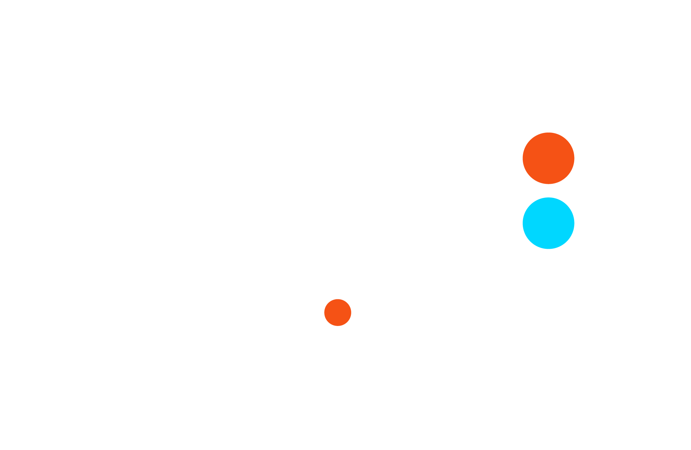

# FME Form Advanced 2025

<figure><figcaption></figcaption></figure>

This is the exercise manual for the FME Form advanced training course for Safe Software’s FME Form application. The exercises in this manual are meant for experienced users of FME Form. These exercises are developed by Sweco and are not officially released by Safe Software.

#### About this document 

This FME Form Advanced course is for users with some experience of FME Form. We assume you are familiar with the contents of the FME Form Basic course. In the exercises you will find words written in _Cursive._ These will help you out solving the questions. You can also look in the "tips" block. Bonus blocks will give you an extra task you can perform on the exercise if you have time left or want to test your skills. Blocks indicated with an "i" always give you some extra information.

#### Revisions: 

Every effort has been made to ensure the accuracy of this document. Sweco apologizes for any errors or omissions that remain and would appreciate being informed of any errors found. Sweco will correct any such errors and omissions in a subsequent version, as feasible. Please contact your trainer.
