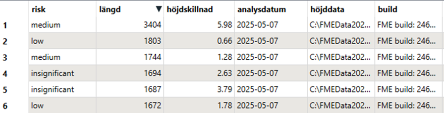

# Exercise 1

The average global temperature for 2024 was over 1.5 degrees above the per-industrial level according to the world meteorological organization. Climate change is here, and climate adaptation has become a crucial topic in governmental decision-making.

**Assignment**:

You have received a task to produce a list of road segments most at risk from rising sea levels in the Skåne region. Your initial analysis should be based on free open data from Lantmäteriet.

You project is to look at all roads within a kilometer from the sea. You have been given the following risk levels to work with:

<table data-header-hidden><thead><tr><th valign="top"></th><th valign="top"></th><th valign="top"></th></tr></thead><tbody><tr><td valign="top">Risk</td><td valign="top">Road size</td><td valign="top">Minimum elevation</td></tr><tr><td valign="top">High</td><td valign="top">Major</td><td valign="top">&#x3C; 1 m</td></tr><tr><td valign="top">Medium</td><td valign="top">Major</td><td valign="top">1-3 m</td></tr><tr><td valign="top">Medium</td><td valign="top">Intermediate</td><td valign="top">&#x3C; 1 m</td></tr><tr><td valign="top">Low</td><td valign="top">Intermediate</td><td valign="top">1-3 m</td></tr><tr><td valign="top">Low</td><td valign="top">Small</td><td valign="top">&#x3C; 1 m</td></tr><tr><td valign="top">Insignificant</td><td valign="top">Major</td><td valign="top">> 3 m</td></tr><tr><td valign="top">Insignificant</td><td valign="top">Intermediate</td><td valign="top">> 3 m</td></tr><tr><td valign="top">Insignificant</td><td valign="top">Small</td><td valign="top">> 1 m</td></tr></tbody></table>

&#x20;

Someone has already produced a polygon representing the area within 1 km from the coastline in the relevant area. It has been saved as a geodatabase here:

* C:\FMEData2025\Data\Prepared\_data\havsnara\_skane.gdb

You have downloaded communications data from Lantmäteriet. You only need the roads, which are in a layer called ”vaglinje”. The geopackage is here:

* C:\FMEData2025\Data\Lantmateriet\topo\_50\_skane\kommunikation\_ln12.gpkg

You have also downloaded the correct raster for the 50 m grid elevation model:

* C:\FMEData2025\Data\Lantmateriet\nh\_skane\_tiff

The output from your analysis should be saved as a file in a useful format of your choice under:

* C:\FMEData2025\Output\Exercise1

In addition to the risk classification, you have been asked to provide the following attributes on each road segment:

* The length of the segment, as an integer
* The difference in elevation between the highest and lowest point on the road segment, rounded to 2 decimal places
* The date of your analysis, in a legible format&#x20;
* The name of the source dataset for the elevation data
* The build and build date of the FME version used in the analysis, on the format: “FME build: \<build nr>, released \<build date>”

<figure><figcaption></figcaption></figure>

Tips:

* You are only interested in parts of your source data, so try to limit the amounts you process. Before going 3D, make sure your elevation and roads data is clipped to your project area.

- The process of transferring elevation data to vector features is known as _draping features_ in FME, so look at the SurfaceDraper transformer. The input port for elevation data is called points/lines, but also accepts rasters.

* To find the maximum and minimum coordinates of a feature can be termed _extracting bounds._ What do you think the transformer is called?

- You’ll notice the roads are not classified as Major, Intermediate, Small. They do however have a type, in the attribute objekttypnr. A suggestion might be to map this as follows:

&#x20;

<table data-header-hidden><thead><tr><th valign="top"></th><th valign="top"></th></tr></thead><tbody><tr><td valign="top">Major</td><td valign="top">1801,1802,1803</td></tr><tr><td valign="top">Intermediate</td><td valign="top">1804,1808,1809,1810</td></tr><tr><td valign="top">Small</td><td valign="top">The rest</td></tr></tbody></table>

Bonus:

To make it easier to look at your result in the visual preview window, try setting the fme\_color attribute based on the risk category. Find an output format that retains your color settings.


From this exercise, you’ve hopefully learnt:

\-          How to drape features on a DEM

\-          How to use conditional values

\-          How to calculate attribute values and use FME functions

