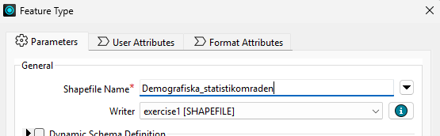
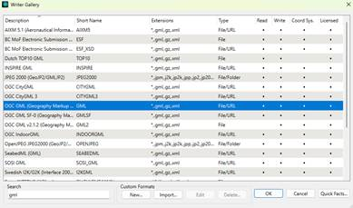

# Exercise 1

You just started working for the Swedish government as a Data analyst.

It is your first day and they already have a task for you that seems to fit your profile perfectly.

Your new colleagues heard that you are a true hero when it comes to working with different kind of data sources and converting them to whatever is required.

They received data about all the demographic statistic areas in Sweden, in the form of an OGC GeoPackage (gpkg). Your colleagues can’t work with this format and asked you if you can try and read it and maybe write it out to a shape file.

**Assignment**:

Read the Geopackage and convert it to a shape file.

**The Geopackage lies in the following location:**

C:\FMEData2026\Data\Demografiska\_Statistikomraden\Demografiska\_statistikomraden.gpkg

**They want you to write it to a new shape file which should be saved as:**

C:\FMEData2026\Output\Demografiska\_statistikomraden.shp

<strong>Tips:</strong>

* There are different ways to read a file in FME.
  1. Browse by Format.
  2. Browse by File
  3. Drag and Drop.
* Writers can be added on different ways. For instance, by clicking on the “Writer” button in the menu bar.
* Do you need to Transform the data or could “Generate workspace” be a good solution?
* When writing to a shape file, you choose a folder to write the file to. The name of the file can be changed in the “FeatureType”**\***.

<strong>Bonus:</strong>

One of your colleagues needs this data in another format and would like to get a GML file. Try to add a second writer to the same workspace and write the same data as a GML fil&#x65;**\*\***.

The data can be saved in the same folder: C:\FMEData2026\Output\Demografiska\_statistikomraden.gml


**\***&#x41; shape is a “folder based” format. 1 shapefile exists out of multiple files (for instance .shp, .dbf, .prj). For Folder based formats you have to choose a folder to write to when adding a writer and set the filename in the FeatureType settings.



**\*\***&#x41; GML file is a “file based” format. All information regarding the date is saved in a single file. Therefore, you will have to instantly write a Filename when adding the writer.


Step-By-Step instructions (Try not to use this!)

#### If you have trouble doing the exercise on your own, you can use these step-by-step instructions to complete the exercise.

1. Open FME Workbench.
2. In the top menu, click on "Build" and choose "Generate Workspace".
3. For the Reader; on the row of "Format", click on the arrow and choose the "OGC GeoPackage" format.\
   &#xNAN;_&#x4D;ake sure you do not choose the "OGC GeoPackage Tiles" format! This will give an error._\
   .png>)
4. Click on the "..." for Dataset and locate the input GeoPackage. For instance: C:\FMEData2026\Data\Demografiska\_Statistikomraden\Demografiska\_statistikomraden.gpkg
5. For the Writer format, choose "Esri Shapefile".
6. Click on the "..." and choose the output "folder". For instance: C:\FMEData2026\Output\exercise1
7. The settings at this point should look something like this:\
   &#x20;
8. Click on "OK". FME will generate the workspace for you. The result should look like this:\
   .png>)
9. You now want to change the output filename to "Demografiska\_statistikomraden.shp" In step 6 you only specified a folder (because an Esri Shapefile is a folder based format). Double click the Writer FeatureType named: "DeSo.2018\_polygon" and change the "Shapefile Name" to "Demografiska\_statistikomraden".\
   
10. Click on "OK".
11. You can now run the workspace and see if FME has written the data by clicking on the folder icon above the "Demografiska\_statistikomraden" FeatureType:\
    .png>)

#### Bonus:

One of your colleagues needs this data in another format and would like to get a GML file. Try to add a second writer to the same workspace and write the same data as a GML fil&#x65;**\*\***.

The data can be saved in the same folder: C:\FMEData2026\Output\Demografiska\_statistikomraden.gml

If you want to write the data to another extra format you will need to add a second writer to the model that writes out the same data. You can do this by taking the following steps:

1. Click on the "Writer" button in the top menu:\
   
2.  As the format choose "OGC GML (Geography Markup Language)". If "OGC GML(Geography Markup Language)" does not appear, click "More Formats" and type it in manually, as shown in the image below.

    
3. Click on the "..." and choose the output folder and filename. For instance: C:\FMEData2026\Output\exercise1\Demografiska\_statistikomraden.gml\
   
4. The end result should look like this:\
   
5. Click on "OK" and you will get a new popup that asks for "Feature Type" parameters. You can leave those as they are and click on "OK" again.
6. Your workspace now looks like this:\
   
7. Now all you have to do is drag a line from the "DeSo.2018" input to the "NewFeatureType". Once you do this, the attributes will automatically come in and you can run the workspace:\
   .png>)

