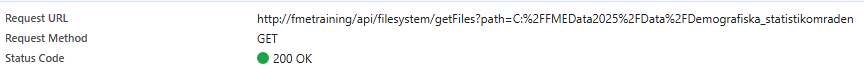

# Tips & Tricks

During this course, you've been working with a system that has already been developed by a frond-end developer. Normally this might not be the case. It would give you more freedom regarding parameters you send in and what kind of methods and paths you use. However, testing might become a bit harder since you are often stuck with the Swagger UI or programs like Postman.

Here we'll try to give you some tips and tricks that you can use during development. Either for Data Virtualization with and Data Virtualization without a front-end application.

## FME Flow Log files.

As always with FME Flow, job logs are very important! If you are working with workspace endpoints and have "Caching" disabled, FME Flow will always run a job when a request is made to Data Virtualization. These jobs work like any other workspace and get a Job ID and Job Log.&#x20;

Make sure to look in these Job Logs to see if there are any errors or warnings that could provide you with a solution if you don't get the expected result or data from your API call.

## Loggers!!!

When working with Data Virtualization (and even with normal workspaces) in FME Flow. You cannot always clearly see what data comes in and what value the attributes have. It can be worth adding a "logger" transformer in your workspace. For instance directly after the "Reader Feature Types":

<figure><figcaption></figcaption></figure>

This will force FME Flow to write out the entire feature in the Job Log. This allows you to see all the attributes and the values coming in. In this case for instance for: "request.path and query.path".

You can then copy and paste these values into FME form when you try to run the workspace there for test purposes.

<figure><figcaption></figcaption></figure>

You are not limited to 1 logger in a workspace. You can add several in different steps of your workspace to see how the data is transformed and if it looks like you expect.

If you do work with multiple loggers in 1 workspace, we'd suggest that you write a hard-coded text in the logger so that you know exactly which logger is triggered. (FME will also log your written text).

For instance like:&#x20;

## DevTools

In our example case we have a web-app in a browser that allows us to run the commands. This opens up a whole new world of analyzing our API requests. We can use the browser "DevTools" to analyze our requests. This function has a different name in browsers. For Google Chrome in Swedish it is called "Verktyg för programmerare".

In almost every browser you can simply open it by using the "F12" button. If that does not work, its often found in the settings:

<figure><figcaption></figcaption></figure>

When you open this, a new screen in your browser will open. It might look quite complex but its great once you get it!

For Data-Virtualization you are mostly interested in the "Network" tab. If you go to this tab and click on anything, you will see all the requests that your browser makes appear and you can analyze each one of them.

For this example, we've activated  "authentication" on the "/delete" endpoint.&#x20;

If we now press on the "delete" button, nothing will happen. When we look in FME Flow, we won't even see a log file. So what happend?

Lets look at the DevTools:

<figure><figcaption></figcaption></figure>

In here we can see that 1 call is marked red which means it failed to process. We can also instantly see the Status code which is 401 (unauthorized).

By clicking on "name" that went wrong, we can see all the details of the call that the browser tried to send. It allows you to look in different tabs to see each step of the process;

* Headers: Contains all the details about the call that has been made. The endpoint, headers, status code etc.
* Payload: This will show you the query parameters you've send in your request or the content body you've send.
* Preview: This will show the result of the call (if it was successful or if it has a proper error).
* Response: This will also show the results as it is returned by the call (in our case often as a JSON or a binary depending on the call we look at). It will be represented as the Content-Type.
* The other tabs are often not used that much since they don't directly help us with error handling and testing.

<figure><figcaption></figcaption></figure>

<figure><figcaption></figcaption></figure>

<figure><figcaption></figcaption></figure>

<figure><figcaption></figcaption></figure>

Looking in the DevTools can often give you leads on things that might have gone wrong. (not just for Data Virtualization).

