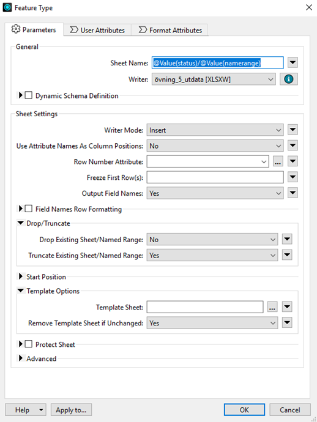

# Övning 5

Projektledaren vill ha en Excell med en flik för de filer som inte finns i leveransmappen och att den ska följa mallen som används i uppdraget. Din uppgift är att låta FME använda befintlig mall och format för din Excell-fil.

\
Mall att använda finns i C:\FMEData2025\Data\Informationssamordnare\15\_Kontroll (1568-C1-21-06033\_mall.xlsx).&#x20;

Utgå från övning 4.


Hur det fungerar (färdigt för övningen men info för framtida bruk):

FME behöver veta vilka celler som den ska skriva till i din mall. I Excell behöver du därför definiera området i Namnhanteraren under Formler, en så kallad Name range. Excel-mallen vi använder har name ranges redan konfigurerats: Filer\_i\_förteckning, Filer\_ej\_i\_leveransmapp, och Filer\_finns\_ej\_i\_förteckning. För att skriva till rätt celler behöver vi referera till dessa i FME-skriptet


Efter fin FeatureMerger/FetureJoiner, lägg till en attributecreator för varje output-port. Skapa ett attribut som heter namerange och för varje flik ge värdet Filer\_i\_förteckning, Filer\_finns\_ej\_i\_leveransmapp, Filer\_ej\_i\_förteckning för respektive flik.&#x20;

Detta attribut kopplar till rätt Name range i excellen (måste vara samma som är definierat i vår excell-mall annars fungerar det inte).

Lägg till en Counter efter varje AttributeCreator med parametrar enligt följande:

* Count Start = 2
* Count Scope = Local
* Output Attribute Names Count = xlsx\_row\_id

Nu har vi valt vilken rad i excellen som ska populeras. Detta attribut kopplas till ”Format Attributes” som vi kan kolla närmare på i vår writer.

Skapa nya writers istället för att att återanvända de från övning 4. För varje excell-writer feature type, ange inställningarna i properties likt nedan.

<figure><figcaption></figcaption></figure>

För _User Attributes_ vill vi ha lika många attribut som vi har i vår Name range, annars så hamnar data utanför mallen. Excell-mallen är uppbyggd med attributen nedan för _Filer i förteckning_ och _Filer ej i leveransmapp_ respektive _Filer finns ej i förteckning_.

<figure><figcaption>
Filer i förteckning och Filer Ej i leveransmapp
</figcaption></figure>

<figure><figcaption>
<em>Filer finns ej i förteckning</em>
</figcaption></figure>

I editeringen av din writer (nås via knapp likt nedan), ange inställningarna likt nedan.

<figure><figcaption></figcaption></figure>

<figure><figcaption></figcaption></figure>

Klicka OK. Stäng Excellmall-filen (annars failar körningen) och kör sedan skriptet.
